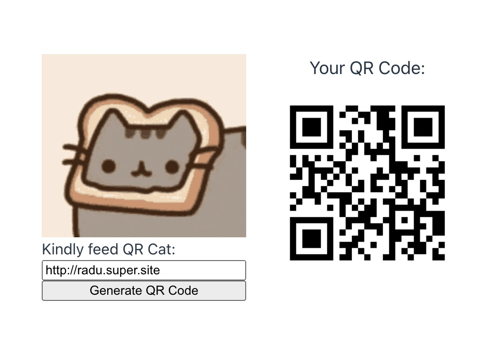

# QR Code Generator

REST API for generating QR codes.

## About the project

### The backend 🏘️
- The `backend` is a `Python & Flask` application which exposes one endpoint `POST /generate` which is used for submitting URLs in form of a JSON payload.
- This payload is then used to generate a QR code image which is then encoded to a base64 string and returned to the client as a JSON response.
- There are tests which cover the url validation function and the qr generation function which are being run when the `Docker container` starts. 
- Failing tests will prevent the container to start. In that case, fixing the tests and then rebuilding the Docker image will be needed.

### The frontend 🚪
- The `frontend` is a `Vue.js` app which runs in Docker from where Vite which is the development server serves to Chrome the app's assets.
- Port forwarding from the local machine to the Docker container makes sure the Vue app is accessible at `http://localhost:8080/`. 
- The frontend renders a simple UI where the user can submit a URL through a form which then takes the user input, validates it, and either displays a validation error in case of a invalid URL or it requests from the backend the processing and retrieval of a QR Code image which is in the end rendered in the UI to the user.

### CORS 🛸
- Since the Vue app makes API calls to another Docker container (from localhost:8080 to localhost:5001), `CORS` is needed and it was configured on the backend to allow incoming requests from origins like `http://localhost:8080`.
- If the backend does not allow CORS, Chrome will block the request with an error.

### Docker 🐳
- Some environment variables are configured in the `.env` file which are used by Docker to configure the containers while others are used by each application at runtime (like for example the VITE_API_URL).


##  How to run

### Prerequisites
Make sure you have Docker and Docker Compose installed on your machine. The easiest and recommended way to get Docker Compose is to install Docker Desktop. Docker Desktop includes Docker Compose along with Docker Engine and Docker CLI which are Compose prerequisites.


### Clone the Repository
```sh
git clone https://github.com/radu2020/castlabs.git
```

### Navigate to project directory
```sh
cd castlabs
```

### Add .env file
```sh
mv .env.example .env
```

### Run with docker
```sh
docker compose up
```
### Verify Docker containers are running
```sh
docker ps
```

```table
| CONTAINER ID   | IMAGE          | COMMAND                   | CREATED          | STATUS          | PORTS                    | NAMES              |
|----------------|----------------|---------------------------|------------------|-----------------|--------------------------|--------------------|
| 89407fa7f471   | castlabs-web   | "docker-entrypoint.s…"     | 12 seconds ago   | Up 10 seconds   | 0.0.0.0:8080->8080/tcp   | castlabs-web-1     |
| 05bdf74500d1   | castlabs-api   | "./entrypoint.sh"          | 12 seconds ago   | Up 11 seconds   | 0.0.0.0:5001->5001/tcp   | castlabs-api-1     |

```


### Access UI at http://localhost:8080/ 👩‍💻



# That's all folks! 🐰